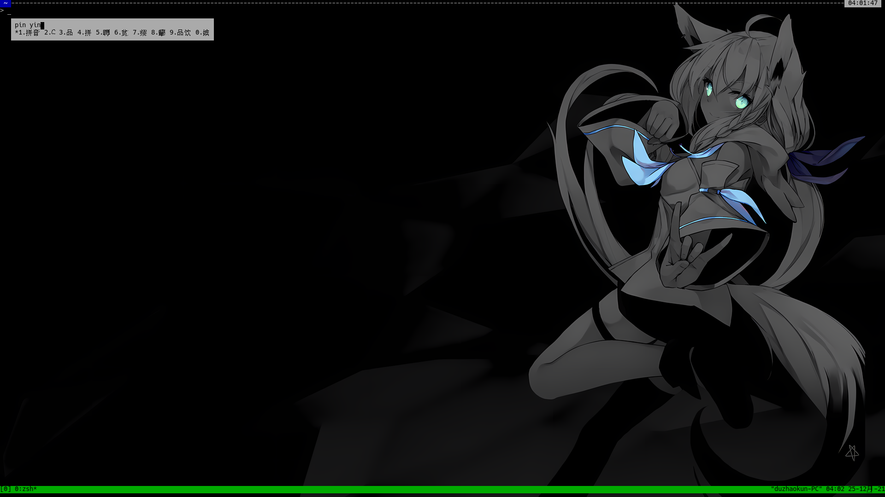

# fcitx5-fbterm
[fcitx-fbterm](https://github.com/fcitx/fcitx-fbterm) 对 [fcitx5](https://github.com/fcitx/fcitx5) 的重构

## 安装
### ArchLinux
[fcitx5-fbterm-git(AUR)](https://aur.archlinux.org/packages/fcitx5-fbterm-git/)
### 其他
见[构建](#构建)

## 构建
### 依赖
- fcitx5
- cmake
- make

### 编译
```shell
git clone https://github.com/duzhaokun123/fcitx5-fbterm
mkdir fcitx5-fbterm/build
cd fcitx5-fbterm/build
cmake ..
make #输出在 fcitx5-fbterm
```

## 用法
```
fcitx5-fbterm --help
Usage: fcitx5-fbterm [options]
Options:
  --help        show this message
  --skip-fbterm skip fbterm connect check
You can create a link (not alias) to set theme:
  fcitx5-fbterm-<ForegroundColor>-<BackgroundColor>
  foreground color default: Black
  background color default: Gray
Color:
  Black, DarkRed, DarkGreen, DarkYellow, DarkBlue, DarkMagenta, DarkCyan, Gray,
  DarkGray, Red, Green, Yellow, Blue, Magenta, Cyan, White
```

## 截图
